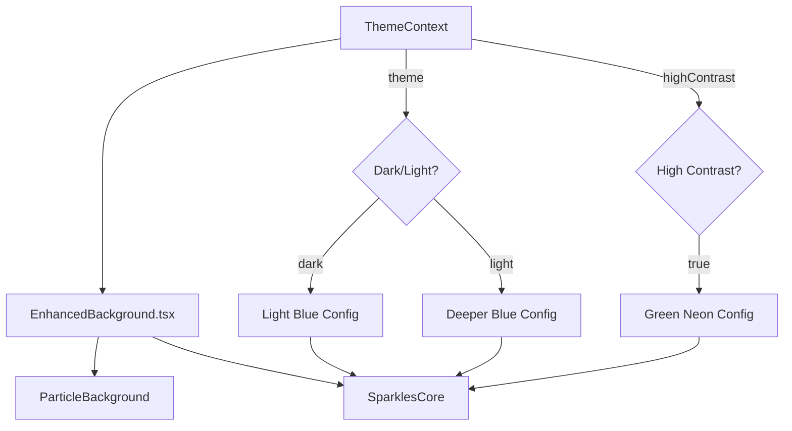

# Particle Animation System

## Overview

The UDS Simulator uses the **Aceternity SparklesCore** library combined with a custom `ParticleBackground` component to create an immersive background visual effect. The particles are theme-aware and automatically adjust their color, density, and speed based on the active theme.

### Key Components

| Component | File | Purpose |
|-----------|------|---------|
| `EnhancedBackground` | [`src/components/EnhancedBackground.tsx`](file:///e:/spec-kit-main/UDS-SIMULATION/src/components/EnhancedBackground.tsx) | Main particle configuration and rendering |
| `SparklesCore` | [`src/components/ui/sparkles.tsx`](file:///e:/spec-kit-main/UDS-SIMULATION/src/components/ui/sparkles.tsx) | Aceternity sparkle animation library |
| `ParticleBackground` | [`src/components/ParticleBackground.tsx`](file:///e:/spec-kit-main/UDS-SIMULATION/src/components/ParticleBackground.tsx) | Ambient particle effects layer |

---

## Current Configuration

> [!NOTE]
> These values were verified on 2025-12-08 and represent the production configuration.

### High Contrast Mode (Green Neon)

```typescript
{
  particleColor: '#00FF00',  // Bright green neon
  minSize: 0.8,
  maxSize: 2.5,
  particleDensity: 80,       // Balanced for smooth performance
  speed: 0.7                 // Very slow, stable animation
}
```

### Dark Theme (Light Blue)

```typescript
{
  particleColor: '#60A5FA',  // Light blue
  minSize: 0.4,
  maxSize: 1.2,
  particleDensity: 80,
  speed: 0.7                 // Very slow, smooth animation
}
```

### Light Theme (Deeper Blue)

```typescript
{
  particleColor: '#3B82F6',  // Deeper blue
  minSize: 0.3,
  maxSize: 0.9,
  particleDensity: 80,       // Consistent across themes
  speed: 0.8                 // Slightly faster but still smooth
}
```

---

## Performance Guidelines

### Recommended Value Ranges

| Parameter | Range | Impact |
|-----------|-------|--------|
| `speed` | 0.5 - 15 | Lower = smoother/slower, Higher = more dynamic |
| `particleDensity` | 50 - 150 | Lower = better performance, Higher = more particles |
| `minSize` | 0.3 - 1.0 | Smallest particle diameter |
| `maxSize` | 0.9 - 3.0 | Largest particle diameter |

### Performance Trade-offs

> [!WARNING]
> Higher density values (>150) may cause performance degradation on lower-end devices.

- **High `particleDensity`**: More visual particles but higher CPU/GPU usage
- **High `speed`**: More dynamic movement but can appear jittery above 12
- **Larger particles (`maxSize > 3`)**: More visible but can be distracting

---

## Troubleshooting

### Common Issues and Solutions

| Issue | Cause | Solution |
|-------|-------|----------|
| Particles too fast/jittery | `speed` value too high | Reduce `speed` (try 50% reduction) |
| Animation feels sluggish | `speed` value too low | Increase `speed` slightly (1-2 increments) |
| Too many particles causing lag | High `particleDensity` | Reduce to 60-80 range |
| Particles too sparse | Low `particleDensity` | Increase (max recommended: 150) |
| High CPU usage | Both values too high | Reduce both `speed` and `particleDensity` |
| Particles not visible | Color too similar to background | Adjust `particleColor` for contrast |

### Testing Checklist

- [ ] Verified configuration values in `EnhancedBackground.tsx`
- [ ] Tested in dark mode
- [ ] Tested in light mode
- [ ] Tested in high contrast dark mode
- [ ] Tested in high contrast light mode
- [ ] Checked all pages (Home, Learning, Cluster)
- [ ] No visible jitter or performance lag

---

## Change History

| Date | Change | Reason |
|------|--------|--------|
| 2025-12-08 | Added React.memo, useMemo, and seeded RNG to prevent particle regeneration | Fixed fast particle movement when clicking Ignition UI |
| 2025-12-08 | Speed values reduced to 0.7-0.8 range | Eliminated jitter, ensured smooth animation |
| 2025-12-07 | Initial optimization: density 150→100, speed 12→8 | Fixed fast particle movement on cluster page |
| - | Original implementation | Initial particle system with Aceternity SparklesCore |

---

## Technical Architecture



### Accessibility Considerations

- The component respects `prefers-reduced-motion` accessibility preference
- All particle elements are marked with `aria-hidden="true"`
- Particles use `pointer-events-none` to avoid interfering with interactive elements

---

## Related Resources

- [Aceternity UI - Sparkles](https://ui.aceternity.com/components/sparkles-background)
- [ThemeContext Implementation](file:///e:/spec-kit-main/UDS-SIMULATION/src/context/ThemeContext.tsx)
- [Workflow: Particle Animation Tuning](file:///e:/spec-kit-main/UDS-SIMULATION/.agent/workflows/particle-animation-tuning.md)
